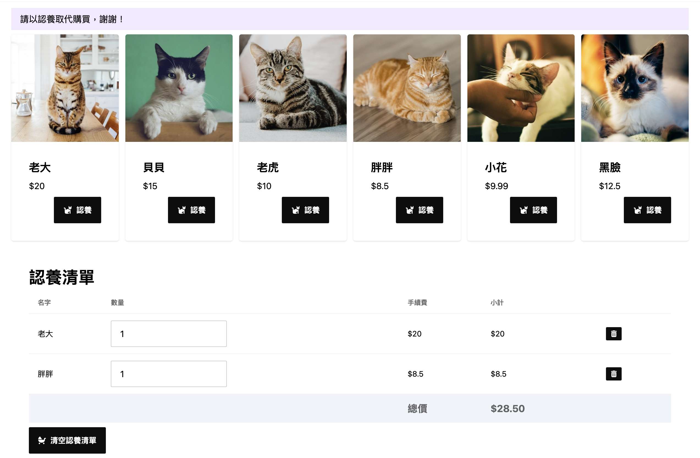

# Shopping Cat Practice v3

## Stacks

- FontAwesome
- Tailwind CSS with DaisyUI
- Vite

## Steps

- run `npm install` to install all packages.
- run `npm run dev` to run a development server on your local machine (maybe port 5173).
- run `npm run api` to run a fake API server on your local machine (port 3002).
- and write all implements in `app.js`.

photo credits: [unsplash](https://unsplash.com/)

by Eddie Kao (eddie@5xcampus.com)
